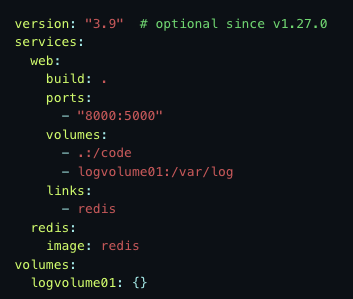

# Docker
#### 1. Was ist Docker?

An open source software platform to create, deploy and manage virtualized application containers 
on a common OS. A container packages the application service or function with all of the libraries, 
configuration files, dependencies and other necessary parts and parameters to operate.

#### 2. Wieso braucht es Docker?
    
With Docker Apps can be developped inside packaged virtual environments which run the same on all operating systems.
Somit wird die Kollaboration bei Entwicklungsprojekten erleichtert, da jeder Entwickler mit den 
"gleichen Voraussetzungen" arbeitet. Es sollte also keine "But it works on my machine"-Situationen geben.

#### 3. Was sind die Vorteile?

- Easier develop- & deployment
- Fast (compared to VMs)
- Portable  
- Lightweight
- Does not use a seperate Kernel but the same resources as the host os
- Easier management of dependencies (because they are on the image)

#### 4. Was sind die Nachteile?

- Security Issues: An attack or vulnerability in the underlying operating system can potentially compromise all 
containers running on the os.    
- Die Zahl an Containern in einer Unternehmung kann sehr gross und somit schwierig zu managen werden.

#### 5. Was ist ein Docker Image?

Auf dem Docker Image wird die lauffähige Version der App gespeichert. Das Image ist das, was deployed wird. 
Docker images contain all the dependencies needed to execute code inside a container, so containers that move 
between Docker environments with the same OS work with no changes. 
Jedes Docker-Image besteht aus einer Reihe von Layern. Diese Layer werden in einem einzelnen Image vereint. 
Wenn sich das Image ändert, wird ein Layer erstellt. Jedes Mal, wenn ein Nutzer einen Befehl wie run oder copy eingibt, 
wird ein neuer Layer erstellt. Dieses Layering ermöglicht Rollbacks und CI/CD.

#### 6. Was ist eine docker-compose Datei?

Compose ist ein Tool zur Definition und Ausführung von Multi-Container-Docker-Anwendungen. Compose verwendet eine 
YAML-Datei, um die Dienste der Anwendung zu konfigurieren. Dann kann man alle Dienste aus der Konfiguration. 
mit einem einzigen Befehl erstellen und in einer isolierten Umgebung starten.

Example docker-compose.yml: !

#### 7. Was ist eine docker-compose.override Datei?

Im Gegensatz zum docker-compose.yaml ist das docker-compose.override.yml optional für die Verwendung von Docker. 
In der Override-Datei können Konfigurations-Overrides für Dienste angegeben werden. Es können auch mehrere
Override-Dateien verwendet werden um z.B. die Compose-App für verschiedene Umgebungen anzupassen. 