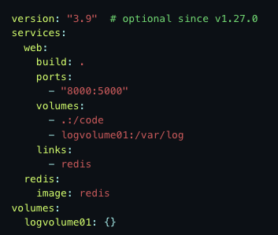

# Docker
#### 1. What is Docker?

An open source software platform to create, deploy and manage virtualized application containers 
on a common OS. A container packages the application service or function with all of the libraries, 
configuration files, dependencies and other necessary parts and parameters to operate.

#### 2. Why do we need Docker?
    
With Docker Apps can be developped inside packaged virtual environments which run the same on all operating systems.
This makes it easier to collaborate on development projects, since every developer is working with the
with the same prerequisites. So there should be no "But it works on my machine" situations.

#### 3. Advantages

- Easier develop- & deployment
- Fast (compared to VMs)
- Portable  
- Lightweight
- Does not use a seperate Kernel but the same resources as the host os
- Easier management of dependencies (because they are on the image)

#### 4. Disadvantages

- Security Issues: An attack or vulnerability in the underlying operating system can potentially compromise all 
containers running on the os.    
- The number of containers in a company can become very large and therefore difficult to manage.

#### 5. What is a Docker Image?

The Docker image is where the executable version of the app is stored and the image is what is deployed. 
Docker images contain all the dependencies needed to execute code inside a container, so containers that move 
between Docker environments with the same OS work with no changes.
Each Docker image consists of a number of layers. These layers are combined into a single image.
When the image changes, a layer is created. Each time a user enters a command such as run or copy,
a new layer is created. This layering allows for rollbacks and CI/CD.

#### 6. What is a docker-compose Datei?

Compose is a tool for defining and running multi-container Docker applications. Compose uses a
YAML file to configure the services of the application. Then we can create all the services from the config 
with a single command and run them in an isolated environment.

Example docker-compose.yml: !

#### 7. What is a docker-compose.override File?

Unlike the docker-compose.yaml, the docker-compose.override.yml is optional for Docker use.
Configuration overrides for services can be specified in the override file. It is also possible to use multiple
override files, e.g. to customize the Compose app for different environments. 